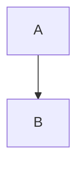

# CMPG323-Overview--29054443
This is the repository for the first project under CMPG323.

# Branching Strategies

My branching strategy as of present will be to create separate project files for all the upcoming semester projects.
should there be changes I will update.
Each project will be having a repository of its own just as I have done for project one.

A is a repository and B a project and this will apply for all the projects 

# Repositories 

I will be creating 4 more separate repositories for the upcpoming projects.
CMPG323-project-2-29054443 for project 2,
CMPG323-project-3-29054443 for project 3,
CMPG323-project-4-29054443 for project 4,
CMPG323-project-5-29054443 for project 5.

#gitignore

I will be including a gitignore file in every project to ensure that lecturers only see the required parts of the projects and not my own separate work and trial-and-error files.

#Storage of credentials and sensitive information
Login to my Github account is a two step verification step which provides a form of security for my account.
I have created a strong password.
