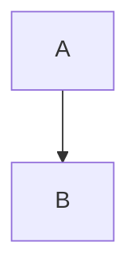

# CMPG323-Overview--29054443
This is the repository for the first project under CMPG323.

# Branching Strategies
My branching strategy as of present will be to create separate project files for all the upcoming semester projects.
should there be changes I will update.
Each project will be having a repository of its own just as I have done for project one.

# Repositories 

I will be creating 4 more separate repositories for the upcpoming projects
CMPG323-project-2-29054443
